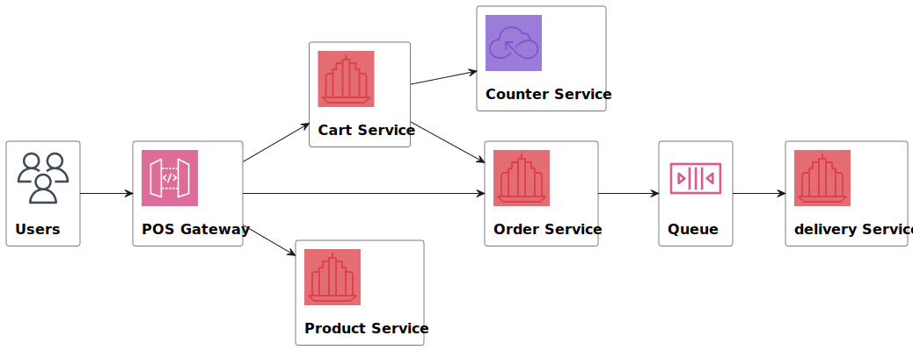

# aw07

Please extend your MicroPOS system by adding a delivery service shown as the following figure.

When an order is placed by a user, the order serivce sends out an event into some AMQP MOM (such as RabbitMQ). The delivery service will be notified and a new delivery entry will be generated automatically. User can query the delivery status for his orders.

Use [Spring Cloud Stream](https://spring.io/projects/spring-cloud-stream) to make the scenerio happen. Of coz you can refer to the [demo](https://github.com/sa-spring/stream-loan) for technical details.

## 作业报告
这项作业被视作aw05的拓展，所以将在aw05中新建一个aw07的branch main branch仍是aw05对应的作业

作业被完成在了[这里](https://github.com/sawork-2022/aw05-Price1999a/tree/aw07)